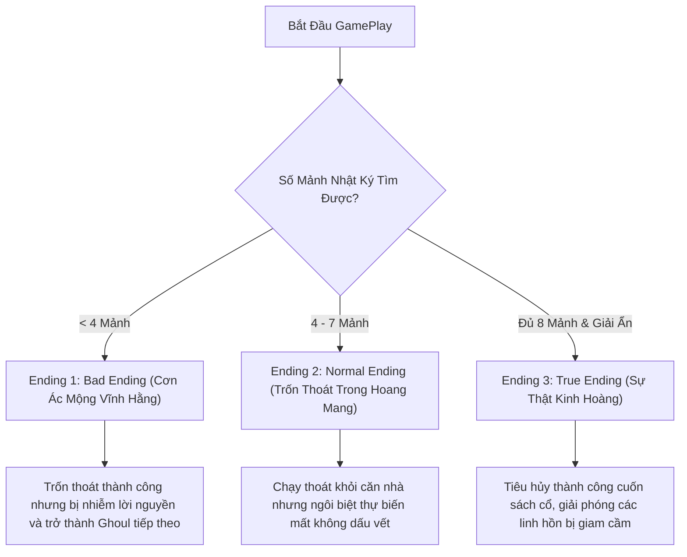
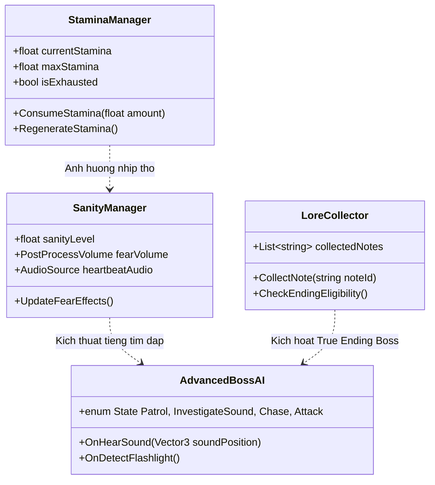

# 🕯️ Đề Xuất Nâng Cấp Cốt Truyện & Lối Chơi (Enhance Gameplay & Storyline Proposal)

> [!NOTE]
> Tài liệu này tổng hợp các ý tưởng thiết kế game (Game Design Document - GDD) đề xuất nhằm nâng tầm trải nghiệm kinh dị, chiều sâu cốt truyện và giá trị chơi lại (Replayability) cho dự án **Horror House**.

---

## 📖 1. Đề Xuất Chi Thừa Cốt Truyện & Đa Kết Cục (Storyline & Multiple Endings Expansion)

### 📜 **Hệ Thống Nhật Ký Rải Rác (Lore Notes & Hidden Collectibles)**
Rải rác 8 mảnh nhật ký cổ quanh các căn phòng biệt thự để kể câu chuyện về thảm kịch gia tộc *Von Erick*:
- **Mảnh 1: Lời Cảnh Báo**: Nhật ký của người quản gia kể về những tiếng gầm gừ dưới căn hầm.
- **Mảnh 2: Nghi Thức Cấm**: Ghi chép của nhà nghiên cứu về việc triệu hồi sinh vật Ghoul.
- **Mảnh 3: Kẻ Sống Sóc Cuối Cùng**: Tiết lộ rằng cổ vật linh hồn (`Ancient Artifact`) thực chất là chìa khóa giam giữ linh hồn của chính gia chủ.

---

### 🎭 **Hệ Thống 3 Kết Cục (Multiple Endings Framework)**

---

## 🎮 2. Đề Xuất Nâng Cấp Cơ Chế Lối Chơi (Enhanced Gameplay Mechanics)

### 🏃 **1. Thanh Thể Lực & Nhịp Thở (Stamina & Breath System)**
- Khi giữ `Left Shift` để chạy nhanh, **Thanh Thể Lực (Stamina)** sẽ giảm dần từ 100% về 0%.
- Khi Stamina < 20%: Nhân vật bắt đầu thở dồn dập, phát ra âm thanh nhịp thở làm Quái vật Ghoul dễ dàng phát hiện vị trí hơn.
- Khi Stamina = 0%: Tốc độ di chuyển giảm xuống 30% trong 3 giây để hồi sức.

---

### 🫀 **2. Hệ Thống Sợ Hãi & Nhịp Tim (Fear & Dynamic Heartbeat System)**
- **Chỉ số Sợ Hãi (Sanity Level)**: Giảm xuống khi đứng trong bóng tối quá lâu hoặc nhìn trực tiếp vào Quái vật Ghoul.
- **Hiệu ứng Thị giác**:
  - Màn hình bị biến dạng (Vignette tối dần, Chromatic Aberration & Grain Effect).
  - Góc nhìn Camera bị rung lắc nhẹ (Camera Shake).
- **Hiệu ứng Thính giác**:
  - Tiếng tim đập `heartbeat.wav` tăng dồn dập theo khoảng cách tới Quái vật Ghoul, giúp cảnh báo nguy hiểm mà không cần nhìn trực tiếp.

---

### 🔦 **3. Đèn Pin 2 Chế Độ (Dual-Mode Flashlight & UV Light)**
- **Chế độ 1: Ánh Sáng Thường (Normal Light)**: Chiếu sáng không gian bóng tối, tiêu tốn pin chuẩn.
- **Chế độ 2: Tia Cực Tím (UV Light - Phím Q)**:
  - Soi thấy vết máu ẩn, dấu chân quái vật trên sàn nhà.
  - Tiết lộ các mật mã bí mật (Hidden Digits) được viết bằng mực dạ quang trên tường để giải các hòm khóa cổ.

---

### 🚪 **4. Cơ Chế Núp Trốn Đa Dạng (Advanced Stealth Mechanics)**
- **Trốn Trong Tủ Quần Áo (Hide in Wardrobes)**: Tiến lại gần tủ quần áo và nhấn `F` để chui vào trốn.
- **Giữ Nín Thở (Hold Breath - Phím Space)**: Khi Ghoul đi ngang qua tủ, giữ phím `Space` để nín thở. Nếu thả phím quá sớm, âm thanh hít thở sẽ tiết lộ vị trí trốn.

---

## 👹 3. Nâng Cấp Trí Tuệ Nhân Tạo Quái Vật (Advanced Ghoul AI Behavior)

| Hành Vi Quái Vật | Mô Tả Trải Nghiệm Kinh Dị |
| :--- | :--- |
| **Phản Ứng Với Tiếng Động** | Ghoul sẽ quay đầu và di chuyển đến kiểm tra nếu người chơi làm rơi đồ, chạy nhanh hoặc mở cửa quá mạnh. |
| **Nhạy Cảm Với Ánh Sáng** | Rọi đèn pin trực tiếp vào mắt Ghoul sẽ khiến nó bị giật mình trong 1 giây nhưng sau đó sẽ kích động chạy nhanh hơn. |
| **Tuần Tra Ngẫu Nhiên (Randomized Patrol)** | Điểm tuần tra của Ghoul được tạo ngẫu nhiên giữa các lần chơi, khiến người chơi không thể học thuộc lòng tuyến đường. |

---

## 🏗️ 4. Sơ Đồ Kiến Trúc Đề Xuất Nâng Cấp (Proposed Code Architecture)

---

## 📋 5. Kế Hoạch Lộ Trình Triển Khai Đề Xuất (Implementation Roadmap)

> [!TIP]
> - **Giai Đoạn 1**: Thêm hệ thống `StaminaManager` & `SanityManager` vào `PlayerController`.
> - **Giai Đoạn 2**: Bổ sung 8 mảnh nhật ký `LoreNote` và UI xem tài liệu tập hợp.
> - **Giai Đoạn 3**: Nâng cấp `AdvancedBossAI` phản ứng với tiếng động và ánh sáng.
> - **Giai Đoạn 4**: Thiết lập 3 Kết Cục (Bad / Normal / True Ending) và hoàn thiện âm thanh hiệu ứng kinh dị.
