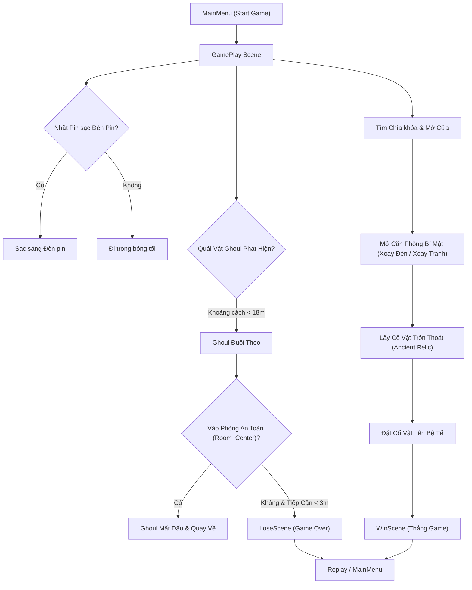

# 📜 Cốt Truyện & Hướng Dẫn Lối Chơi Chi Tiết (Gameplay & Storyline Guide)

> [!NOTE]
> Dự án **Horror House** thuộc thể loại Game Kinh Dị Sinh Tồn Góc Nhìn Thứ Nhất (First-Person Horror Survival / Puzzle Escape). Người chơi phải tìm cách trốn thoát khỏi biệt thự bằng cách tìm kiếm chìa khóa, kích hoạt các cơ quan bí mật và trốn né quái vật Ghoul.

---

## 🗺️ 1. Sơ Đồ Luồng Game (Game Loop Flowchart)

---

## 📖 2. Cốt Truyện Chi Tiết (Detailed Storyline)

### **Bối Cảnh (Setting)**
Bạn tỉnh dậy trong một ngôi biệt thự cổ hoang tàn, u tối và đầy u ám mang tên **Horror House**. Mọi cửa ra vào đều bị khóa chặt bằng các loại chìa khóa cổ bí ẩn. Trong không gian yên ắng đáng sợ, những tiếng thì thầm vô hình và tiếng bước chân lạ vang lên khắp các hành lang.

### **Diễn Biến Cốt Truyện (Plot Progress)**

> [!IMPORTANT]
> - **Cảnh 1: Thức Tỉnh & Hoang Mang (The Awakening)**:  
>   Nhân vật chính nhận ra mình bị giam cầm trong căn nhà quái dị này. Với duy nhất một chiếc đèn pin cầm tay trên tay, bạn phải mò mẫm qua từng căn phòng tăm tối. Những câu thoại vang lên trong tâm trí: *"Có chuyện gì đang xảy ra ở đây vậy?"*, *"Chuyện này không thể là thật được!"*.

> [!NOTE]
> - **Cảnh 2: Khám Phá Các Căn Phòng Khóa (Unlocking the Quarters)**:  
>   Để mở đường tiến sâu vào ngôi nhà, bạn phải tìm kiếm các chìa khóa được cất giấu trên các bàn cổ:
>   - `Key_LivingTable`: Chìa khóa mở cửa Phòng Khách (`Living_Door`).
>   - `Key_RainerTable`: Chìa khóa mở khu vực Rainer (`Rainer_Door`).
>   - `Key_WandaTable`: Chìa khóa mở khu vực Wanda (`Wanda_Door`).
>   - `Key_FinalTable`: Chìa khóa mở cánh cửa Cuối Cùng (`Final_Door`).

> [!TIP]
> - **Cảnh 3: Cơ Quan Bí Mật & Căn Hầm Ngầm (The Secret Chamber)**:  
>   Ngôi biệt thự ẩn chứa những lối đi bí mật. Bằng cách xoay chiếc đèn treo tường, một cơ quan ẩn sẽ kích hoạt mở ra cánh cửa bí mật (`Secret Door`). Xoay bức tranh cổ sẽ hé lộ căn phòng họp bí mật (`Meeting Room`) dẫn xuống căn hầm bí ẩn (`The Secret Basement`).

> [!WARNING]
> - **Cảnh 4: Sự Truy Đuổi Của Quái Vật (The Ghoul Stalker)**:  
>   Một sinh vật đột biến hung tợn (**Ghoul Zombie**) đang lang thang khắp các hành lang để săn tìm kẻ xâm nhập. Khi phát hiện ra bạn, nó sẽ gầm lên kinh hoàng và lao đến tấn công. Cách duy nhất để sống sót là chạy thật nhanh hoặc trốn vào các căn phòng an toàn (`Room_Center`) nơi quái vật không thể tiếp cận.

> [!IMPORTANT]
> - **Cảnh 5: Giải Thích & Thoát Khỏi Cơn Ác Mộng (The Escape / Victory)**:  
>   Tại căn phòng tế bí mật, bạn tìm thấy Cổ Vật Linh Hồn (`Ancient Artifact`). Đặt cổ vật lên bệ tế lễ sẽ giải trừ lời nguyền của ngôi nhà, mở ra cánh cửa thoát hiểm duy nhất để bạn trốn thoát thành công (`WinScene`).

---

## 🎮 3. Hướng Dẫn Lối Chơi Chi Tiết (Detailed Gameplay Mechanics)

### **Bộ Phím Điều Khiển (Controls)**

| Phím / Thao Tác | Chức Năng | Chi Tiết Trạng Thái |
| :--- | :--- | :--- |
| `W`, `A`, `S`, `D` | Di chuyển nhân vật | Phát tiếng bước chân `footStep` |
| `Di chuyển Chuột` | Xoay góc nhìn camera 360 | Giới hạn góc ngước X từ -60 đến 60 độ |
| `Giữ Left Shift` | Chạy nhanh | Tăng tốc độ từ `5` lên `8`, phát tiếng `runSound` |
| `Phím E` | Bật / Tắt Đèn pin | Điều khiển `Light.intensity` & hiệu ứng phát sáng vật liệu kính |
| `Phím F` | Tương tác môi trường | Nhặt chìa khóa, mở cửa, xoay tranh/đèn bí mật, đặt cổ vật |
| `Phím ESC` / `Enter` | Menu / Xác nhận Replay | Đặt lại `Time.timeScale = 1f` và mở con trỏ chuột |

---

### 🧩 4. Hướng Dẫn Giải Đố Từng Bước (Step-by-Step Walkthrough Guide)

1. **Bước 1: Khởi động Đèn Pin**:
   - Nhấn phím `E` để bật đèn pin. Chú ý thu gom các cục Pin trên bàn để duy trì độ sáng.

2. **Bước 2: Tìm Chìa Khóa Phòng Khách (`Key_LivingTable`)**:
   - Tiến lại chiếc bàn ở khu vực đầu tiên, bấm `F` để nhặt chìa khóa. Chìa khóa xuất hiện trên tay.
   - Tiến tới `Living_Door` và nhấn `F` để mở cửa.

3. **Bước 3: Mở Lối Đi Bí Mật (Secret Lamp & Painting)**:
   - Trong phòng làm việc, tiến lại gần chiếc đèn treo tường, bấm `F` để xoay đèn -> Cửa bí mật `OpenSecretDoor` mở ra.
   - Tiến lại gần bức tranh cổ trên tường, bấm `F` để xoay tranh -> Căn phòng họp ẩn `OpenMeetingRoom1` & `2` mở ra.

4. **Bước 4: Trốn Tránh Quái Vật Ghoul**:
   - Khi nghe tiếng gầm của Ghoul, ngưng di chuyển hoặc chạy thẳng vào vùng an toàn `Room_Center` (tâm các căn phòng). Quái vật sẽ mất dấu và bỏ đi.

5. **Bước 5: Nhặt Cổ Vật & Trốn Thoát (Win Game)**:
   - Đi xuống căn hầm bí mật, tiến lại bệ tế nhặt Cổ Vật (`Item`).
   - Mang Cổ vật tới bệ tế chính (`Platform`) và nhấn `F` để kích hoạt chiến thắng (`WinScene`).

---

## 📁 5. Danh Sách Màn Chơi (Scenes List)

1. `Assets/Scenes/MainMenu.unity`: Màn hình chính (Bắt đầu, Tùy chỉnh âm thanh/đồ họa, Thao tác thoát).
2. `Assets/Scenes/GamePlay.unity`: Màn chơi chính (Khám phá ngôi nhà, giải đố, chạy trốn quái vật).
3. `Assets/Scenes/LoseScene.unity`: Màn hình Thua (Hiển thị khi bị quái vật bắt).
4. `Assets/Scenes/WinScene.unity`: Màn hình Thắng (Hiển thị khi trốn thoát thành công).
