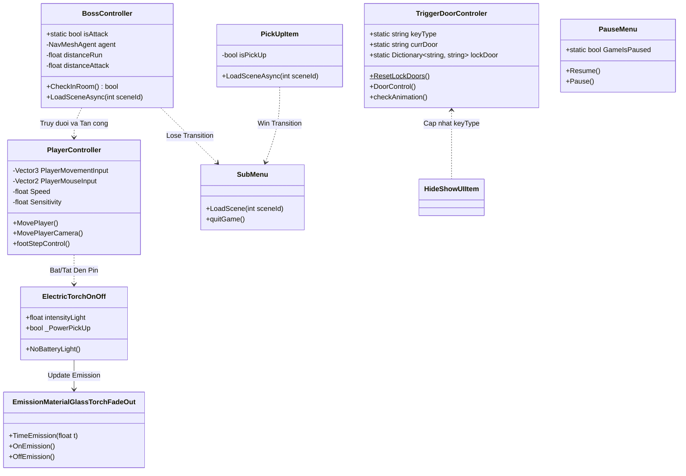

# 🛠️ Tài Liệu Mã Nguồn & Kiến Trúc Dự Án Chi Tiết (Source Code & Architecture Documentation)

Tài liệu này tổng hợp toàn bộ cấu trúc mã nguồn C#, sơ đồ kiến trúc (Architecture Diagram), chi tiết các API/Script, quy trình Build CLI và danh sách tối ưu hiệu năng thuộc dự án **Horror House** (Unity 2021.3.45f2 / URP 12.1.15).

---

## 🏗️ 1. Sơ Đồ Kiến Trúc Hệ Thống (System Architecture Diagram)



---

## 📁 2. Chi Tiết Các Script Trong Dự Án (API Reference)

### 👤 **Nhóm Điều Khiển Nhân Vật & Đèn Pin**

#### 1. `PlayerController.cs`
- **Mục đích**: Quản lý di chuyển nhân vật góc nhìn thứ nhất (FPS), xoay camera theo chuột, chạy nhanh (`Shift`), và phát âm thanh bước chân.
- **Thành phần phụ thuộc**: `Rigidbody`, `AudioSource`, `Transform` (PlayerCamera).
- **Chi tiết API**:
  - `Awake()`: Tự động cache `PlayerBody = GetComponent<Rigidbody>()` và khóa xoay `freezeRotation = true`.
  - `MovePlayer()`: Cập nhật `PlayerBody.velocity` theo hướng di chuyển và tốc độ (`Speed = 5` khi đi bộ, `Speed = 8` khi giữ `LeftShift`).
  - `footStepControl()`: Sử dụng `audioSource.PlayOneShot` để phát mượt tiếng bước chân `footStep` hoặc tiếng chạy `runSound`.

#### 2. `ElectricTorchOnOff.cs`
- **Mục đích**: Bật/tắt đèn pin (`Key E`) và điều khiển cường độ sáng (`Light.intensity`).
- **Thành phần phụ thuộc**: `Light`, `EmissionMaterialGlassTorchFadeOut`.
- **Chi tiết API**:
  - `NoBatteryLight()`: Cập nhật `Light.intensity` và gọi `_emissionMaterialFade.OnEmission()` / `OffEmission()` an toàn với null check.

#### 3. `EmissionMaterialGlassTorchFadeOut.cs`
- **Mục đích**: Điều khiển màu sắc phát sáng (`_EmissionColor`) của vật liệu kính đèn pin.
- **Chi tiết API**:
  - `OnEmission()` / `OffEmission()`: Cập nhật `_EmissionColor` trên Material rendering.
  - `TimeEmission(float t)`: Giảm dần độ sáng khi pin cạn kiệt.

#### 4. `BatteryPowerPickup.cs`
- **Mục đích**: Xử lý va chạm Trigger khi người chơi nhặt Pin để sạc lại năng lượng cho đèn pin.
- **Phương thức chính**: `OnTriggerEnter(Collider other)` đặt `_torchOnOff.intensityLight = PowerIntensityLight`.

---

### 👹 **Nhóm AI Quái Vật & Tương Tác Cửa / Cơ Quan**

#### 5. `BossController.cs`
- **Mục đích**: Quản lý AI Quái vật (Ghoul Zombie), di chuyển bằng `NavMeshAgent`, phát hiện nhân vật, tấn công và phát tiếng gầm kinh dị.
- **Biến tĩnh**: `public static bool isAttack = false;`
- **Tối ưu hóa**:
  - Cache mảng `Room_Center` trong `CheckInRoom()` để tránh gọi `FindGameObjectsWithTag` mỗi frame.
  - Thắt chặt tần suất gọi `agent.SetDestination()` (throttle 0.15s hoặc khi người chơi di chuyển > 0.5m) giúp tiết kiệm tài nguyên CPU.
  - Tự động mở khóa con trỏ chuột (`Cursor.visible = true`) trước khi nạp `LoseScene`.

#### 6. `TriggerDoorControler.cs`
- **Mục đích**: Quản lý trạng thái đóng/mở của 5 loại cửa và cơ chế mở cửa bằng chìa khóa tương ứng.
- **Biến tĩnh**:
  - `public static string keyType`: Tên chìa khóa người chơi đang cầm trên tay.
  - `public static string currDoor`: Tên cánh cửa người chơi đang đứng gần.
  - `public static Dictionary<string, string> lockDoor`: Từ điển ánh xạ cửa và chìa khóa tương ứng (`Living_Door` -> `Key_LivingTable`, v.v.).
- **Khắc phục lỗi Collision**: Khi cửa mở (`!isClose`), `doorCollider.isTrigger` luôn được giữ là `true`, đảm bảo người chơi di chuyển qua lại dễ dàng mà không bị tường ẩn cản đường.
- **Tự động Reset**: Phương thức `ResetLockDoors()` trong `Awake()` đảm bảo từ điển cửa khóa luôn được khôi phục khi chơi lại.

#### 7. `TriggerSecretDoor.cs` & `OpenSecretMeetingroom.cs`
- **Mục đích**: Điều khiển hoạt ảnh xoay Đèn / xoay Bức Tranh để mở cánh cửa ẩn và lối vào phòng họp bí mật.
- **Luồng xử lý**: Sử dụng Coroutine `Wait()` phát hoạt ảnh xoay trước 1.5 giây, sau đó phát hoạt ảnh mở cửa.

#### 8. `PickUpItem.cs`
- **Mục đích**: Xử lý việc nhặt Cổ vật và đặt lên bệ tế để Thắng Game (Win).
- **Tối ưu va chạm**: Tự động vô hiệu hóa tất cả `Collider` trên `visualItem1` khi cầm trên tay để tránh va chạm vật lý với người chơi.
- **Chuyển cảnh**: Mở khóa con trỏ chuột trước khi nạp `WinScene`.

---

### 🖥️ **Nhóm Giao Diện UI & Menu Systems**

#### 9. `MainMenu.cs`
- **Mục đích**: Điều khiển màn hình chính (Start Game, Fade transitions, Quit).
- **Phương thức chính**:
  - `LoadScene(int sceneId)`: Khởi chạy Coroutine `LoadSceneAsync`.
  - Khởi tạo `Time.timeScale = 1f` và mở khóa con trỏ chuột `Cursor.visible = true` trong `Start()`.

#### 10. `SubMenu.cs`
- **Mục đích**: Xử lý giao diện màn kết thúc game (`LoseScene` & `WinScene`).
- **Điểm cải tiến**:
  - `Start()` mở khóa con trỏ chuột để người chơi tương tác với nút bấm UI.
  - Phím `Enter` / `Esc` hỗ trợ nạp lại Main Menu (`LoadScene(0)`), phục vụ cơ chế Replay mượt mà.

#### 11. `PauseMenu.cs`
- **Mục đích**: Quản lý menu Tạm dừng (`ESC`).
- **Biến tĩnh**: `public static bool GameIsPaused = false;`
- **Phương thức chính**:
  - `Pause()`: Hiện UI pauseMenu, khóa thời gian `Time.timeScale = 0f`, mở con trỏ chuột.
  - `Resume()`: Ẩn UI pauseMenu, đặt `Time.timeScale = 1f`, ẩn con trỏ chuột.

#### 12. `OptionMenuScript.cs`, `BgVolumnSlider.cs`, `VfxSlider.cs`, `SoundManager.cs`
- **Mục đích**: Điều chỉnh độ phân giải, chế độ toàn màn hình, chất lượng đồ họa và âm thanh nền / hiệu ứng thông qua `PlayerPrefs`.
- **Tối ưu**: Loại bỏ polling `PlayerPrefs` liên tục trong `Update()`.

#### 13. `MusicControlScript.cs`
- **Mục đích**: Singleton phát nhạc nền xuyên suốt game bằng `DontDestroyOnLoad(this.gameObject)`.

---

## 🛠️ 3. Script Công Cụ Build Tự Động (CLI Build Tool)

#### `Assets/Editor/BuildScript.cs`
```csharp
using UnityEditor;
using UnityEngine;
using System.IO;

namespace HorrorHouse.Build
{
    public static class BuildScript
    {
        public static void BuildGame()
        {
            Debug.Log("[BUILD_CLI] Starting Windows 64-bit Build...");

            string buildDir = "Builds";
            if (!Directory.Exists(buildDir))
            {
                Directory.CreateDirectory(buildDir);
            }

            string buildPath = Path.Combine(buildDir, "HorrorHouse.exe");
            string[] scenes = new string[]
            {
                "Assets/Scenes/MainMenu.unity",
                "Assets/Scenes/GamePlay.unity",
                "Assets/Scenes/LoseScene.unity",
                "Assets/Scenes/WinScene.unity"
            };

            BuildPlayerOptions options = new BuildPlayerOptions();
            options.scenes = scenes;
            options.locationPathName = buildPath;
            options.target = BuildTarget.StandaloneWindows64;
            options.options = BuildOptions.None;

            var report = BuildPipeline.BuildPlayer(options);
            Debug.Log("[BUILD_CLI] Build result: " + report.summary.result + ", Output size: " + report.summary.totalSize + " bytes");
        }
    }
}
```

---

## 🚀 4. Hướng Dẫn Build Dự Án Chi Tiết (Developer Setup & Build Guide)

### **1. Yêu Cầu Cấu Hình (Requirements)**
- **Unity Version**: Unity `2021.3.45f2` (LTS).
- **Render Pipeline**: Universal Render Pipeline (URP `12.1.15`).
- **OS**: Windows 10/11 64-bit.

### **2. Lệnh Build Game Tự Động Từ Command Line (CLI)**
Mở PowerShell hoặc Command Prompt tại thư mục gốc dự án và chạy lệnh:

```bash
"C:\Program Files\Unity\Hub\Editor\2021.3.45f2\Editor\Unity.exe" -batchmode -nographics -quit -projectPath "." -executeMethod HorrorHouse.Build.BuildScript.BuildGame -logFile "Builds/build_exec.log"
```

Sau khi chạy thành công, file thực thi `HorrorHouse.exe` sẽ được tạo tại thư mục `Builds/`.

---

## ⚡ 5. Danh Sách Tối Ưu Hóa Hiệu Năng (Optimization Checklist)

- [x] **UI Canvas Redraw**: Kiểm tra `activeSelf` trước khi gọi `SetActive()` ở tất cả các UI prompt script.
- [x] **PlayerPrefs Polling**: Loại bỏ truy vấn `PlayerPrefs` mỗi frame trong `SoundManager.cs`.
- [x] **NavMesh AI Throttling**: Giới hạn tần suất gọi `SetDestination()` ở `BossController.cs`.
- [x] **Callback Cleanup**: Xóa bỏ các phương thức `Update()` / `Start()` rỗng để giảm chi phí C++ Reflection.
- [x] **Collision Safety**: Tự động disable Collider trên vật phẩm cầm tay (`key_hand` / `visualItem1`) để không gây giật lag vật lý nhân vật.
